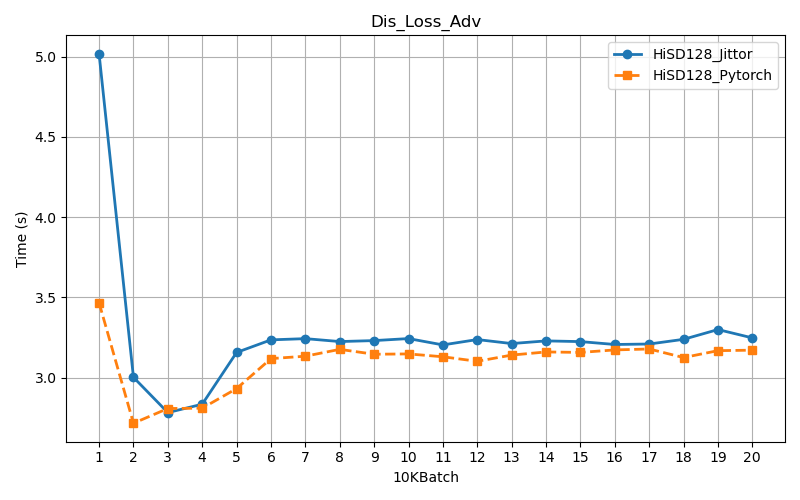

# HiSD-Jittor
HiSD implementation based on Jittor  

The examples in Samples are the results of sampling after training in the HiSD official experimental architecture. These images may have undergone sample enhancement processing such as color perturbation and rotation.

[CheckPoint For Jittor Version on 128×128 images](https://drive.google.com/file/d/1UD7pFR8yMLg6bwfLGcWK8EN1wNoSF5NI/view?usp=sharing)  

[CheckPoint For Pytorch Version on 128×128 images](https://drive.google.com/file/d/1AIye0Gs16cepKiyLaalzlCcJNzKEoot5/view?usp=sharing)

Performance Table  

Time Lines  

Dis_Loss_Adv  

In order to facilitate the observation of the gap, all Gen-Losses are drawn from the 20Kth batch.

This table shows the average of each Gen-Loss on the first 10K batches  
|  | Gen_Loss_Adv | Gen_Loss_Sty |Gen_Loss_Rec|
|--------|--------|--------|--------|
| Pytorch  | 21.046  | 2.236  |1.632|
| Jittor | 582.015  | 13.116  |3.017|

Gen_Loss_Adv  

Gen_Loss_Sty  

Gen_Loss_Rec  

